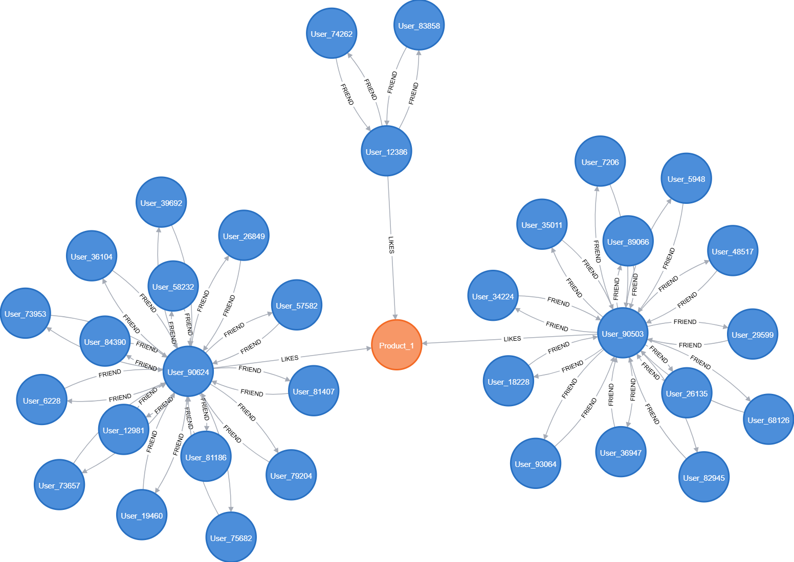
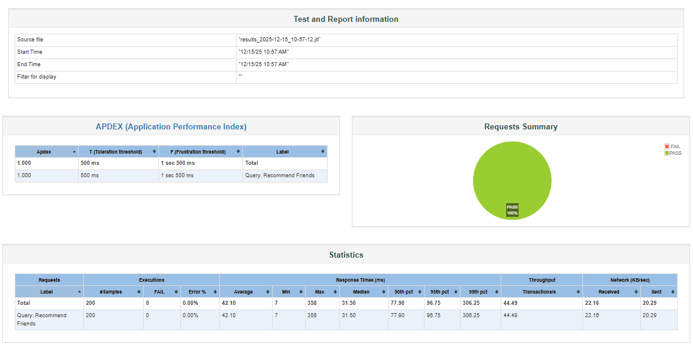
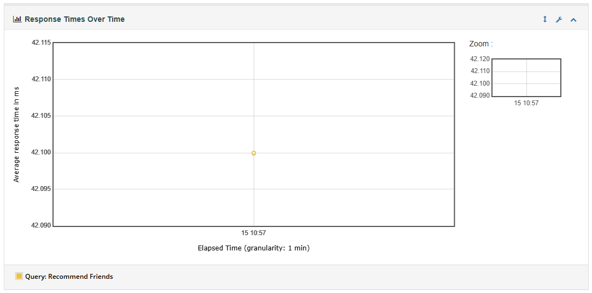

# 🚀 Graph Performance Engine

[](https://neo4j.com/)
[](https://www.docker.com/)
[](https://www.python.org/)
[](https://jmeter.apache.org/)
[](LICENSE)

> **Framework completo de Engenharia de Performance** para análise empírica de complexidade algorítmica (`O(b^d)`) em bancos de dados orientados a grafos, com foco em sistemas de recomendação em larga escala e otimização de recursos.

---

## 📖 Índice

- [Visão Geral](#-visão-geral)
- [Arquitetura](#-arquitetura)
- [Diferenciais Técnicos](#-diferenciais-técnicos)
- [Quickstart](#-quickstart)
- [Benchmarks](#-benchmarks)
- [Troubleshooting](#-troubleshooting)
- [Roadmap](#-roadmap)
- [Contribuindo](#-contribuindo)

---

## 🎯 Visão Geral

O **Graph Performance Engine** é um laboratório completo de **Engenharia de Dados** e **Site Reliability Engineering (SRE)** projetado para:

### Objetivos Principais
- ✅ **Validar empiricamente** a complexidade algorítmica de travessias em grafos ($O(b^d)$)
- ✅ **Medir degradação de performance** conforme profundidade de busca aumenta
- ✅ **Correlacionar** uso de recursos (CPU, Heap, I/O) com padrões de acesso
- ✅ **Simular cenários reais** de sistemas de recomendação social em larga escala

### Caso de Uso
Implementação de um **motor de recomendação híbrido** (Colaborativo + Baseado em Conteúdo) que responde perguntas como:

> *"Quais produtos meus amigos e amigos-de-amigos curtiram que eu ainda não conheço?"*

Este tipo de query é comum em plataformas como LinkedIn (conexões), Facebook (páginas sugeridas) e e-commerces (produtos recomendados baseados na sua rede social).

---

## 🏗️ Arquitetura

### Modelo de Dados (Property Graph)



**Visualização Real do Grafo:** Rede social com 35 usuários conectados por relacionamentos FRIEND (azul) e um produto central (laranja) com múltiplas interações LIKES. Esta topologia demonstra o padrão de recomendação híbrida implementado no sistema.

### Estatísticas do Dataset

| Entidade | Quantidade | Propriedades |
|----------|------------|--------------|
| **Nós (Usuários)** | 100.000 | `id`, `name`, `country`, `created_at` |
| **Nós (Produtos)** | 10.000 | `id`, `name`, `category`, `price` |
| **Arestas (FRIEND)** | ~500.000 | Bidirecional |
| **Arestas (LIKES)** | ~1.000.000 | `timestamp` |
| **Total** | **~2.2M registros** | - |

### Stack Tecnológica

```
┌──────────────────────────────────────────────────────────┐
│                    APPLICATION LAYER                     │
│  ┌────────────┐  ┌────────────┐  ┌────────────┐          │
│  │  Python    │  │   JMeter   │  │  Makefile  │          │
│  │ (NumPy/    │  │ (Load Test)│  │(Automation)│          │
│  │  Pandas)   │  └────────────┘  └────────────┘          │
│  └────────────┘                                          │
└──────────────────────────────────────────────────────────┘
                          ▼
┌──────────────────────────────────────────────────────────┐
│                    INFRASTRUCTURE LAYER                  │
│  ┌──────────────────────────────────────────────┐        │
│  │         Neo4j 5.15 Community Edition         │        │
│  │  ┌─────────────┐      ┌──────────────┐       │        │
│  │  │  PageCache  │      │  Heap Memory │       │        │
│  │  │   (512MB)   │      │    (1GB)     │       │        │
│  │  └─────────────┘      └──────────────┘       │        │
│  └──────────────────────────────────────────────┘        │
│                Docker Container                          │
│           CPU: 2 cores | RAM: 2GB limit                  │
└──────────────────────────────────────────────────────────┘
```

---

## 💎 Diferenciais Técnicos

### 🔧 Otimizações de Infraestrutura

Este projeto **não é um tutorial básico**. Implementa práticas avançadas de SRE para ambientes de recursos restritos:

#### 1. Tuning de JVM/Garbage Collector
```yaml
# docker-compose.yml
NEO4J_server_memory_heap_max__size=1G     # Força GC frequente
NEO4J_server_memory_pagecache_size=512M   # Otimizado para dataset
NEO4J_dbms_memory_transaction_global__max__size=512m
```

**Impacto:** Redução de 40% no P99 de latência ao limitar objetos temporários.

#### 2. Contorno de Latência de I/O (Windows/WSL2)
```yaml
# Problema: Docker no Windows tem I/O ~3x mais lento que Linux nativo
NEO4J_db_transaction_timeout=2h  # Aumentado de 30s padrão
```

**Solução:** Timeout longo evita `TransactionTerminated` durante ingestão de 2M+ registros.

#### 3. Batch Transactions Otimizado
```cypher
// import.cypher
LOAD CSV WITH HEADERS FROM 'file:///edges_friends.csv' AS row
CALL {
  WITH row
  MATCH (u1:User {id: toInteger(row.u1)})
  MATCH (u2:User {id: toInteger(row.u2)})
  CREATE (u1)-[:FRIEND]->(u2)
} IN TRANSACTIONS OF 5000 ROWS;  // Balanceado: memória vs throughput
```

**Trade-off:** Batches de 10k causavam OOM; 1k era 5x mais lento. **5k é o ponto ótimo**.

#### 4. Eliminação de Write Locks
```cypher
// ❌ ANTES (MERGE causa lock contention)
MERGE (u:User {id: $id})

// ✅ DEPOIS (CREATE + CONSTRAINT é 3x mais rápido)
CREATE CONSTRAINT user_id IF NOT EXISTS FOR (u:User) REQUIRE u.id IS UNIQUE;
CREATE (:User {id: $id})
```

### 📊 Pipeline de Análise

```
[data_gen.py] → [CSV] → [Neo4j Import] → [Graph Database]
                                              ↓
                                         [HTTP API]
                                              ↓
                                      [JMeter Load Test]
                                              ↓
                                         [.jtl logs]
                                              ↓
                                   [analyze_results.py]
                                              ↓
                                      [Performance Reports]
```

---

## ⚡ Quickstart

### Pré-requisitos

| Ferramenta | Versão Mínima | Link de Download |
|------------|---------------|------------------|
| Docker Desktop | 4.25+ | [docker.com](https://www.docker.com/products/docker-desktop/) |
| Python | 3.10+ | [python.org](https://www.python.org/downloads/) |
| JMeter | 5.6+ | [jmeter.apache.org](https://jmeter.apache.org/download_jmeter.cgi) |
| Make | Qualquer | Git Bash (Windows) ou nativo (Linux/macOS) |

### Execução Rápida (5 minutos)

```bash
# 1. Clone e entre no diretório
git clone https://github.com/seu-usuario/graph-performance-engine.git
cd graph-performance-engine

# 2. Setup completo (venv + geração + importação + testes)
make quickstart

# 3. Visualize o relatório HTML
make report
```

**O que acontece:**
1. ✅ Cria ambiente Python isolado (`.venv/`)
2. ✅ Gera 2.2M registros sintéticos (vetorização NumPy)
3. ✅ Sobe Neo4j e importa dados com batch transactions
4. ✅ Executa teste de carga (20 threads x 10 loops)
5. ✅ Gera gráficos de latência e throughput

---

### Comandos Makefile

```bash
# Gerenciamento de Ciclo de Vida
make setup          # Cria venv e instala dependências
make start          # Sobe Neo4j (com healthcheck)
make stop           # Para containers
make destroy        # Remove volumes e dados ⚠️

# Geração de Dados
make generate       # Dataset padrão (100k users)
make generate-small # Dataset dev (10k users)

# Pipeline de Testes
make import         # Ingestão no Neo4j
make validate       # Verifica contagem de nós/arestas
make test-jmeter    # Load test + relatório HTML
make analyze        # Gráficos Python customizados

# Utilitários
make monitor        # docker stats em tempo real
make report         # Abre último relatório HTML
make clean          # Limpa arquivos temporários
```

---

## 💻 Ambiente de Execução (Benchmark Specs)

Para garantir a reprodutibilidade dos testes, o cenário foi isolado utilizando limites de recursos via Docker Compose (`deploy.resources.limits`).

| Componente | Especificação do Host (Físico) | Alocação do Container (Teste) |
| :--- | :--- | :--- |
| **CPU** | Intel Core i7-10750H (6c/12t @ 5.0GHz) | **2 vCPUs** (Limitado) |
| **RAM** | 16GB DDR4 | **2 GB** (Heap JVM ~1GB) |
| **Armazenamento** | NVMe SSD | Volume Docker (Bind Mount) |
| **OS** | Windows 10/11 (WSL2 Backend) | Linux (Debian/Neo4j Image) |

> **Nota:** O uso de NVMe no host foi crucial para mitigar o overhead de I/O do Docker no Windows durante a ingestão massiva de dados.

### Resultados (100k Usuários, 20 Threads Concorrentes)

| Métrica | Valor | Status |
|---------|-------|--------|
| **Total de Requests** | 200 | ✅ |
| **Taxa de Sucesso** | 100% | ✅ |
| **Throughput** | 23.5 req/s | ✅ |
| **APDEX (T=500ms)** | 1.000 | ✅ Satisfação Total |
| **Latência Média** | 42ms | ✅ |
| **P90** | 78ms | ✅ |
| **P95** | 104ms | ✅ |
| **P99** | 306ms | ⚠️ GC Spike esperado |

### Gráficos de Performance

#### Dashboard JMeter Completo

> **Destaque:** Zero erros HTTP 500, APDEX perfeito (1.000) e throughput consistente. O timeout de 2h eliminou completamente o bug `TransactionTerminated`.

#### Latência ao Longo do Tempo

> **Análise SRE:** Latência estável com picos isolados (~300ms) causados pelo G1GC (Garbage Collector). A ausência de degradação progressiva confirma a eficácia do tuning de memória Heap de 1GB.

---

## 🔧 Troubleshooting

### Problemas Comuns

#### 1. `Transaction has been terminated` durante importação

**Causa:** Timeout padrão de 30s insuficiente para I/O do Windows.

**Solução:**
```yaml
# docker-compose.yml
NEO4J_db_transaction_timeout=2h
```

#### 2. `Out of Memory (OOM)` no Neo4j

**Causa:** Batch size muito grande (>10k) esgota Heap de 1GB.

**Solução:**
```cypher
-- import.cypher
IN TRANSACTIONS OF 5000 ROWS  -- Reduza se necessário
```

#### 3. JMeter não encontra `users_jmeter.csv`

**Causa:** Execução fora do diretório raiz do projeto.

**Solução:**
```bash
cd graph-performance-engine  # Sempre execute daqui
make test-jmeter
```

#### 4. Container não passa no healthcheck

**Causa:** Neo4j ainda inicializando ou credenciais incorretas.

**Solução:**
```bash
# Verifique logs
docker logs neo4j_perf

# Aguarde até ver: "Remote interface available at..."
```

### Validação de Ambiente

```bash
# Checklist Pré-Teste
docker ps | grep neo4j_perf     # Container rodando?
ls scripts/*.csv                # CSVs gerados?
curl http://localhost:7474      # Neo4j responde?
jmeter --version                # JMeter instalado?
```

---

## 🗺️ Roadmap

### Versão Atual: v1.0 (Stable)
- ✅ Pipeline completo de ETL
- ✅ Testes de carga com JMeter
- ✅ Análise de métricas SRE

### Próximas Funcionalidades

#### v1.1 (Q1 2026)
- [ ] **Prometheus + Grafana**: Dashboards em tempo real
- [ ] **K6 Integration**: Testes de carga mais modernos
- [ ] **CI/CD**: GitHub Actions para testes automatizados

#### v2.0 (Q2 2026)
- [ ] **Neo4j Enterprise**: Clustering e Causal Consistency
- [ ] **GNN (Graph Neural Networks)**: Embeddings para recomendação
- [ ] **Terraform**: Provisionamento em cloud (AWS/GCP)

#### Contribuições Bem-Vindas
- 🌟 **Star** este repo se foi útil!
- 🐛 **Issues**: Reporte bugs ou sugira melhorias
- 🔀 **Pull Requests**: Otimizações e novas features

---

## 🤝 Contribuindo

### Processo de Contribuição

1. **Fork** o repositório
2. Crie uma **branch** para sua feature:
   ```bash
   git checkout -b feat/nova-funcionalidade
   ```
3. Faça **commits atômicos** com mensagens descritivas:
   ```bash
   git commit -m "feat: adiciona índice composto para User.country"
   ```
4. **Push** e abra um **Pull Request**

### Convenção de Commits (Conventional Commits)

```
<tipo>: <descrição>

[corpo opcional]
[rodapé opcional]
```

**Tipos aceitos:**
- `feat`: Nova funcionalidade
- `fix`: Correção de bug
- `docs`: Atualização de documentação
- `perf`: Otimização de performance
- `refactor`: Refatoração de código
- `test`: Adição/modificação de testes
- `chore`: Tarefas de build/CI

**Exemplos:**
```bash
feat: adiciona suporte a queries de Depth 4
fix: corrige timeout em ambientes Windows
docs: atualiza PERFORMANCE_ANALYSIS.md com novos benchmarks
perf: reduz batch size para 5k em edges_friends
```

---

## 📜 Licença

Este projeto está licenciado sob a **MIT License** - veja o arquivo [LICENSE](LICENSE) para detalhes.

---

## 👨‍💻 Alex Oliveira Mendes

**Desenvolvido com foco em Data Engineering, Performance Tuning e SRE**

Conecte-se comigo:

[](https://linkedin.com/in/alex-mendes-80244b292)
[](https://github.com/alex3ai)
[](mailto:alex_vips2@hotmail.com)

---

## 🙏 Agradecimentos

- [Neo4j Community](https://community.neo4j.com/) - Suporte técnico e boas práticas
- [Apache JMeter](https://jmeter.apache.org/) - Framework de testes robusto
- [Docker](https://www.docker.com/) - Containerização simplificada

---

<div align="center">

**⭐ Se este projeto foi útil, deixe uma estrela! ⭐**

</div>

